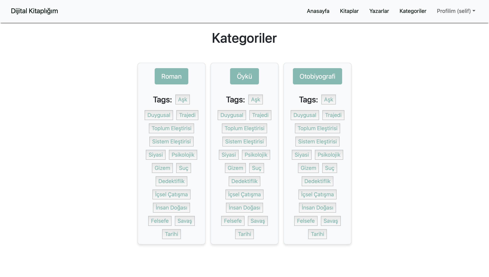

# Dijital Kitaplığım

Kendi dijital kitap arşivinizi oluşturabileceğiniz bir web uygulaması.

---

## Ekran Görüntüleri

### Giriş / Kayıt

### Anasayfa

### Kitaplar

### Kitap Detay

### Yazarlar

### Yazar Detay

### Kategoriler ve Filtreleme

### Okuma Listesi

### Admin Paneli

---

## Özellikler

- Login / Register modal arayüzleri.
- Giriş sonrası kitapları listelere ekleyebilme.
- Kitap ve yazar detaylarını görüntüleme.
- Kitapları kategori, etiket ve yazara göre filtreleyebilme.
- Okuma listeleri oluşturma, düzenleme ve silebilme.
- Okuma listelerine kitap ekleme ve çıkarma.
- Admin paneli ile kitap ekleme, düzenleme ve silme.

---

## Kullanılan Teknolojiler

- Frontend: React (Vite + TypeScript), Bootstrap
- Backend: ASP.NET Core Web API
- Veritabanı: Microsoft SQL Server
- Authentication: JWT + Cookie tabanlı giriş sistemi

---